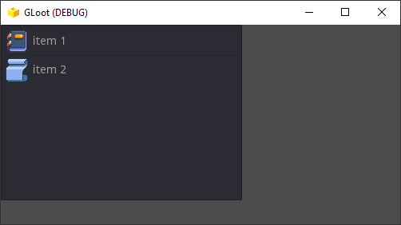
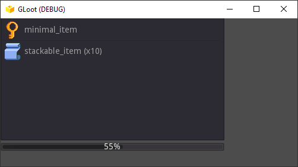
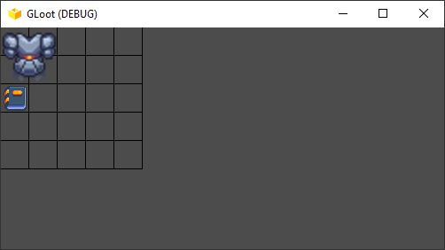
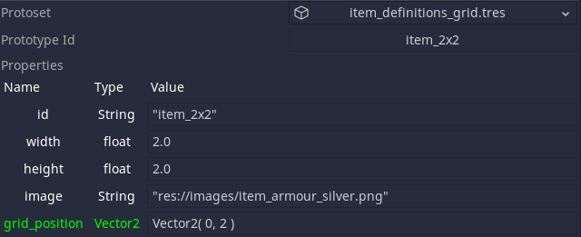
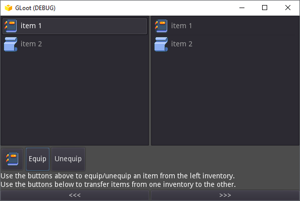
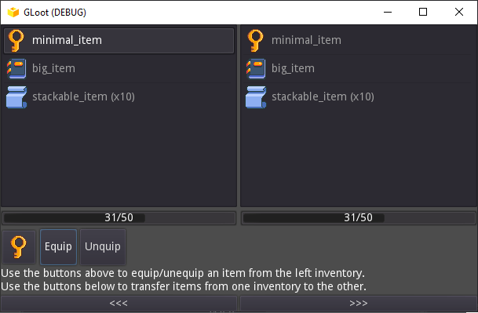
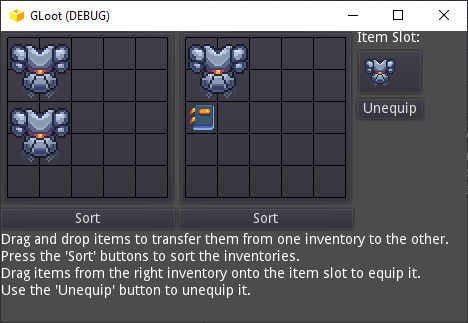

# GLoot

# Test Comment

<p align="center">
  
</p>

A universal inventory system for the Godot game engine (version 3.x and newer).
> **NOTE**: The current version in development is v2.0, which is not compatible with older versions (see [Releases](https://github.com/peter-kish/gloot/releases)).

## Table of Contents

1. [Features](#features)
    1. [Item Prototypes](#item-prototypes)
    2. [Inventory Items](#inventory-items)
    3. [Inventory Types](#inventory-types)
    4. [Item Slots](#item-slots)
    5. [UI Controls](#ui-controls)
2. [Installation](#installation)
3. [Usage](#usage)
4. [Creating Item Prototypes](#creating-item-prototypes)
    1. [Minimal Item Protoset JSON](#minimal-item-protoset-json)
    2. [Item prototypes for a Stack Based Inventory](#item-prototypes-for-a-stack-based-inventory)
    3. [Item prototypes for a Grid Based Inventory](#item-prototypes-for-a-grid-based-inventory)
    4. [Additional Prototype Fields](#additional-prototype-fields)
    5. [Editing item properties](#editing-item-properties)
5. [Serialization](#serialization)
6. [The Documentation](#the-documentation)
7. [Examples](#examples)

## Features

### Item Prototypes

*  [`ItemProtoset`](docs/item_protoset.md) - A resource type holding a set of [inventory item prototypes](#creating-item-prototypes) in JSON format.

### Inventory Items

*  [`InventoryItem`](docs/inventory_item.md) - Inventory item class. It is based on an item prototype from an [`ItemProtoset`](docs/item_protoset.md) resource. Can hold additional [properties](#editing-item-properties).

### Inventory Types

*  [`Inventory`](docs/inventory.md) - Basic inventory class. Supports basic inventory operations (adding, removing, transferring items etc.). Can contain an unlimited amount of items.
*  [`InventoryStacked`](docs/inventory_stacked.md) - Has a limited item capacity in terms of weight. Inherits `Inventory`.
*  [`InventoryGrid`](docs/inventory_grid.md) - Has a limited capacity in terms of space. The inventory capacity is defined by its width and height. Inherits `Inventory`.

### Item Slots

*  [`ItemSlot`](docs/item_slot.md) - Holds a reference to a given item from a given inventory. The slot can be cleared or bound to one item at a time. In case the item is removed from the inventory or the slot is bound to a different inventory, the slot is automatically cleared.

### UI Controls

User interfaces are usually unique for each project, but it often helps to have some basic UI elements ready for earlier development phases and testing. The following controls offer some basic interaction with the various [inventory types](#inventory-types).

*  [`CtrlInventory`](docs/ctrl_inventory.md) - UI control representing a basic [`Inventory`](docs/inventory.md). Displays a list of items in the inventory. Uses the `name` item property to display the item name in the list.


*  [`CtrlInventoryStacked`](docs/ctrl_inventory_stacked.md) - UI control representing a stack based inventory ([`InventoryStacked`](docs/inventory_stacked.md)). It lists the contained items and shows an optional progress bar displaying the capacity and fullness of the inventory. Inherits `CtrlInventory`.


*  [`CtrlInventoryGrid`](docs/ctrl_inventory_grid.md) - UI control representing a grid based inventory ([`InventoryGrid`](docs/inventory_grid.md)). Displays a grid based on the inventory capacity (width and height) and the contained items on the grid. The items can be moved around in the inventory by dragging. Uses the `image` item property (path to a texture) to display the item on the grid.


*  [`CtrlItemSlot`](docs/ctrl_item_slot.md) - UI control representing an ([`ItemSlot`](docs/item_slot.md)).

## Installation

1. Create an `addons` directory inside your project directory.
2. Get the plugin from the AssetLib or from GitHub
    * From the AssetLib: Open the AssetLib from the Godot editor and search for "GLoot". Click download to install the plugin.
    * From GitHub: Run `git clone https://github.com/peter-kish/gloot.git` and copy the contents of the `addons` directory to your projects `addons` directory.
4. Enable the plugin in `Project Settings > Plugins`.

## Usage

1. Create an [`ItemProtoset`](docs/item_protoset.md) resource that will hold all the item prototypes used by the inventory. The resource has a single property `json_data` that holds all item prototype information in JSON format (see [Creating Item Prototypes](#creating-item-prototypes) below).
2. Create an inventory node in your scene. Set its capacity if needed (required for [`InventoryStacked`](docs/inventory_stacked.md) and [`InventoryGrid`](docs/inventory_grid.md)) and set its `item_protoset` property (previously created).
3. Add items to the inventory in one of the following ways:
    1. Add items using the custom control in the inspector:

    

    2. Add items by creating `InventoryItem` nodes as child nodes of the inventory node.
        > **NOTE**: When an `InventoryItem` node is added to an inventory node, its `protoset` property is automatically set to be the same as the `item_protoset` property of the inventory node.

    3. Add items from code. Use [`create_and_add_item()`](docs/inventory.md) to create and add items based on the given prototype ID:
    ```gd
    inventory.create_and_add_item("Item1")
    ```

4. (*Optional*) Create [item slots](#item-slots) that will hold various items (for example the currently equipped weapon or armor).
5. Create some [UI controls](#ui-controls) to display the created inventory and its contents.
6. Call `add_item()`, `remove_item()`, `transfer_item()` etc. from your scripts to move items around multiple inventory nodes. Refer to the [documentation](#the-documentation) for more details about the available properties, methods and signals for each class.

## Creating Item Prototypes

An item prototype is a set of item properties that all items based on that prototype will contain. Items based on a specific prototype can override these properties or add new properties that are not defined in the prototype.

Item protosets represent a number of item prototypes based on which future inventory items will be created.
An item prototype is defined by its ID and its properties.

### Minimal Item Protoset JSON

There are a few requirements each protoset JSON must fulfill:

* The JSON must be a JSON array containing JSON objects.
* Each element of the array must contain the `id` property uniquely identifying the prototype.

Below is an example of a minimal item protoset JSON:

```json
[
    {
        "id": "minimal_item"
    }
]
```

### Item prototypes for a Stack Based Inventory

Prototypes of items contained in stack based inventories support the following additional properties:

* `stack_size` - Defines the default stack size of the item. Newly created items that use this prototype will have this stack size. Has the value of 1 if not defined.
* `weight` - Defines the unit weight of the item. Has the value of 1.0 if not defined.
    **NOTE**: The total weight of an item is defined as its unit weight multiplied by its stack size.

Example:
```json
[
    {
        "id": "stackable_item",
        "stack_size": 10
    },
    {
        "id": "heavy_item",
        "weight": 20.0
    },
    {
        "id": "very_heavy_item",
        "stack_size": 10,
        "weight": 20.0
    }
]
```

* The total weight of a `stackable_item` is 10 - The unit weight is not defined and the default value of 1.0 is used. Multiplied with `stack_size` of 10 gives a total weight of 10.0.
* The total weight of a `heavy_item` is 20.0 - The stack size is not defined and the default value of 1 is used. Multiplied with `weight` of 20.0 gives a total weight of 20.0.
* The total weight of a `very_heavy_item` is 200.0 - The stack size of 10 is multiplied with the unit weight of 20.0.

### Item prototypes for a Grid Based Inventory

Prototypes of items contained in stack based inventories support the following additional properties:

* `width` - Defines the width of the item. Has the value of 1 if not defined.
* `height` - Defines the height of the item. Has the value of 1 if not defined.

Example:
```json
[
    {
        "id": "1x1_knife",
        "width": 1,
        "height": 1
    },
    {
        "id": "1x3_spear",
        "width": 1,
        "height": 3
    },
    {
        "id": "2x2_bomb",
        "width": 2,
        "height": 2
    }
]
```

### Additional Prototype Fields

Apart from the previously mentioned properties, item prototypes can hold all kinds of additional user-defined data. Properties like "name" or "description" are often used and can be easily added alongside the predefined properties.

Example:
```json
[
    {
        "id": "knife_01",
        "weight": "2.0",
        "name": "Kitchen Knife",
        "description": "A knife intended to be used in food preparation."
    }
]
```

Any of the item properties can be accessed from code through the `get_property()` methods of the [`InventoryItem`](docs/inventory_item.md) classes:
```gd
var item_name = item.get_property("name", "")
var item_description = item.get_property("description", "")
```

### Editing item properties

Item properties defined in the [`ItemProtoset`](docs/item_protoset.md) resource can be overridden for each individual item using the `set_property()` method and overridden property values can be cleared using the `clear_property()` method:
```gd
# Decrease the size of an item stack by 1
var stack_size: int = item.get_property("stack_size")
if stack_size > 0:
    item.set_property("stack_size", stack_size - 1)
```

Item properties can also be modified and overridden using the inspector when an `InventoryItem` is selected. Properties marked with green color represent overridden properties.



## Serialization

All GLoot classes have a `serialize()` and a `deserialize()` method that can be used for serialization.
The `serialize()` methods serializes the class into a dictionary, that can be further serialized into JSON, binary or some other format.

Example:
```gd
# Serialize the inventory into a JSON string
var inventory: Inventory = get_node("inventory")
var dict: Dictionary = inventory.serialize()
var json: String = JSON.print(dict)
```

The `deserialize` methods receive a dictionary as argument that has been previously generated with `serialize()` and apply the data to the current class instance.

Example:
```gd
# Deserialize the inventory from a JSON string
var inventory: Inventory = get_node("inventory")
var res: JSONParseResult = JSON.parse(json)
if res.error == OK:
    var dict = res.result
    inventory.deserialize(dict)
```

## The Documentation

The docs can be found [here](./docs/docs.md).

## Examples

Take a look at the `examples` directory for some example scenes:
* `inventory_transfer.tscn` - Displaying two basic inventories (`Inventory`) and transferring items between them.


* `inventory_stacked_transfer.tscn` - Displaying two stack based inventories (`InventoryStacked`) and transferring items between them.


* `inventory_grid_transfer.tscn` - Displaying two grid based inventories (`InventoryGrid`) and transferring items between them using drag and drop.


